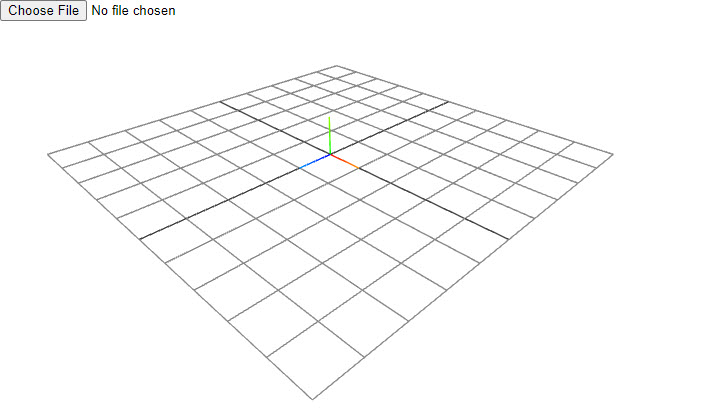

# ifcjs-viewer-101

Basic source code for Web-IFC-Viewer

> check out the [following repository](https://github.com/AnweshGangula/ifcjs-viewer) for additional features

This project is a [hello world example](https://ifcjs.github.io/web-ifc-viewer/example/index) set-up for [web-ifc-viewer](https://ifcjs.github.io/info/docs/Guide/web-ifc-viewer/Introduction).

- web-ifc-viewer is a 3D BIM viewer with many tools and functionalities already implemented (section drawings, dimensions, etc.), allowing you to create BIM tools with very little effort.
- Also check-out [web-ifc-three](https://ifcjs.github.io/info/docs/Guide/web-ifc-three/Introduction) which is a boilerplate 3D BIM Viewer with no in-built functionalities. You can use this if you want to build your own custom application with full control over the implementation.
  - Check out [this repo](https://github.com/AnweshGangula/ifcjs-101) for basics

## Setting up the project (Pre-IFC.js)

The first thing to do is to create an empty folder and [start a new npm project](https://docs.npmjs.com/cli/v8/commands/npm-init) with the command `npm init`. This will generate a package.json file containing some data such as the project name, version, commands and dependencies

### Installing libraries

The next step is to install the dependencies necessarry for this project. Below are the commands that install the respective dependencies:

```bash
npm i web-ifc-viewer

npm i rollup --save-dev
npm i @rollup/plugin-node-resolve --save-dev
```

### Index.html

The next step is to create an HTML file named index.html as the main document of the application. The HTML will have:

- A div element, used to render the web-ifc-viewer.
- An input element, which will open IFC files from our computer to the application.
- A script referencing a file called bundle.js, which is the bundle of the app that we will produce with rollup.

```html
<!DOCTYPE html>
<html lang="en">
	<head>
		<meta charset="UTF-8" />
		<meta http-equiv="X-UA-Compatible" content="IE=edge" />
		<link rel="icon" type="image/png" href="./favicon.ico" />
		<link rel="preconnect" href="https://fonts.gstatic.com" />
		<link href="https://fonts.googleapis.com/css2?family=Roboto&display=swap" rel="stylesheet" />
		<link rel="stylesheet" type="text/css" href="./styles.css" />
		<meta name="viewport" content="width=device-width, initial-scale=1.0" />
		<title>IFC.js</title>
	</head>

	<body>
		<input type="file" id="file-input" />
		<div id="viewer-container"></div>
		<script src="./bundle.js"></script>
	</body>
</html>
```

### Adding style

The following CSS file will make the canvas full screen:

```css
* {
	margin: 0;
	padding: 0;
	box-sizing: border-box;
}

html,
body {
	overflow: hidden;
}

#viewer-container {
	position: fixed;
	/* top: 0; */
	left: 0;
	outline: none;
	width: 100%;
	height: 100%;
}
```

## Setting up the project (IFC.js)

### WebAssembly

The next thing to do is to copy the web-ifc.wasm and `web-ifc-mt.wasm` files to a directory in your project. It can be found in `node_modules\web-ifc` (or `node_modules\three\examples\jsm\loaders\ifc` if you are only using Three's IFCLoader). We can copy them wherever we want; in this example, they will be copied to a folder called wasm in the root directory of the project.

These files are necessary because they contain the compiled C++ logic of [web-ifc](https://github.com/IFCjs/web-ifc), which is the parsing core to read and write IFC files with native speed.

> These files have to be served statically in your application. This might need different tweaks if you are using frameworks or libraries like React, Angular, Vue or Svelte.

## Setting up 3D-Scene (web-ifc-viewer)

We are now going to create the JavaScript file to write the code for our application (eg: index.js). This file can be located anywhere and have any name, but you must reflect this in the `rollup.config.js` in the next step.

Below code is where we are setting up a basic threejs scene using web-ifc-viewer. In the next step we will add the functionality to load models into this viewer.

```js
import { Color } from "three";
import { IfcViewerAPI } from "web-ifc-viewer";

const container = document.getElementById("viewer-container");
const viewer = new IfcViewerAPI({ container, backgroundColor: new Color(0xffffff) });
viewer.axes.setAxes();
viewer.grid.setGrid();

const input = document.getElementById("file-input");

window.ondblclick = () => viewer.IFC.selector.pickIfcItem(true);
window.onmousemove = () => viewer.IFC.selector.prePickIfcItem();
viewer.clipper.active = true;

window.onkeydown = (event) => {
	if (event.code === "KeyP") {
		viewer.clipper.createPlane();
	} else if (event.code === "KeyO") {
		viewer.clipper.deletePlane();
	}
};
```

## Loading IFC files

### Loading user's models

Finally, we will use IFC.js to load IFC files by allowing the user to choose a local file and using the `IfcViewerAPI()` we instantiated above to load the model.

```js
input.addEventListener(
	"change",

	async (changed) => {
		const file = changed.target.files[0];
		const ifcURL = URL.createObjectURL(file);
		viewer.IFC.loadIfcUrl(ifcURL);
	},

	false
);
```

> Keep in mind that if you haven't saved the wasm files in the root of served files of the project, you'll need to specify its location with `setWasmPath`. For instance, if we had them stored in a folder called `wasm` contained in a folder called `static` in the root of the project, we would do the following:

> ```
> await viewer.IFC.setWasmPath("static/wasm/");
> ```



If you have done everything correctly, you should be able to see something similar to [this](https://ifcjs.github.io/web-ifc-viewer/example/index) in your local server. From here, the possibilities are endless.

### Manual Bundling

> Note: At this point, we need to manually bundle this js file using any bundler.

You can bundle this file using any bundler. We are going to use [rollup](https://rollupjs.org/guide/en/#quick-start) to bundle this by using the following command:

```
npx rollup index.js -o bundle.js -f es -p @rollup/plugin-node-resolve
```

which is short for:

```
npx rollup index.js --file bundle.js --format es --plugin @rollup/plugin-node-resolve
```

### Bundling config

Next, we'll create the rollup configuration file to save the bundling configuration and run the file instead of typing the entire command each time. This file has to be called `rollup.config.js` and includes the reference to the plugins we have previously installed.

```javascript
import resolve from "@rollup/plugin-node-resolve";

export default {
	input: "index.js",
	output: [
		{
			format: "esm",
			file: "bundle.js",
		},
	],
	plugins: [resolve()],
};
```

Also, the `package.json` file needs to be modified to contain the scripts to control rollup easily. In each script, you'll have to specify the relative path to your rollup configuration file. If we have installed everything correctly, we should see the same dependencies in this file (the version of the libraries may differ).

- `npm run build` will bundle the project and create a file called bundle.js in the root directory of the project.

- `npm run watch` will activate the watch mode, updating that file automatically every time we make changes to the code and save it.

```json
...
  "scripts": {
    "build": "rollup -c ./rollup.config.js",
    "watch": "rollup -w -c ./rollup.config.js"
  },
...
```

### Running the app

You'll be able to see the application as expected once your have bundled the index.js file to bundle.js using roll-up.

To run the application locally after bundling the file, we will need a local server. If you are using VS Code as IDE, one option is to install the [Live Server extension](https://marketplace.visualstudio.com/items?itemName=ritwickdey.LiveServer), which allows us to open an instance of Google Chrome, run our web application and see the changes we make to the code in real-time.

### Loading IFC files (from server)

In order to load a ifc file from a server, you need to use the `loadIfcUrl()` to convert the model path url into something that the web-ifc-viewer can read. Below is the `loadIfc(url)` function that does that.

```js
async function loadIfc(url) {
	// await viewer.IFC.setWasmPath("static/wasm/");
	const model = await viewer.IFC.loadIfcUrl(url);
	viewer.shadowDropper.renderShadow(model.modelID);
}

loadIfc("models/01.ifc");
```
